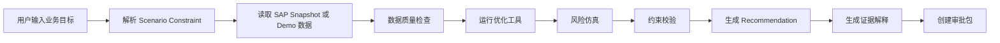
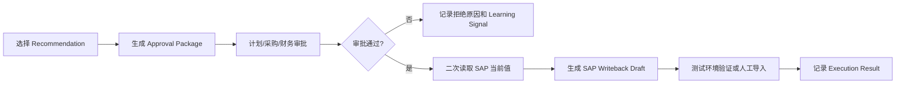

# ChainPilot AI 产品设计文档

版本：v0.1  
日期：2026-05-28  
仓库：zssggle-rgb/chainpilot-ai  
应用名：chainpilot_ai  

## 1. 资料边界

本设计文档基于 `cankao/ChainPilot_AI_PRD_需求与实施文档_v1.0.pdf` 形成。该 PDF 是需求依据。

`cankao/may_procurement_optimization_report.html` 是真实 SAP 分析报告，用于理解当前业务现状、基线数据和演示样例，不作为功能需求的直接来源。报告中的 5,015 种物料、6.44 亿采购计划、499 次参数采样、84 个最优解、六类策略，可作为种子数据、演示指标和现状说明，但产品范围以 PDF 需求为准。

## 2. 产品定位

ChainPilot AI 是面向 SAP 供应链计划与采购场景的 AI 决策与执行 Agent。它不替代 SAP，也不替代现有优化算法，而是把 SAP 计划数据和优化结果转化为可解释、可审批、可回写草稿化、可追踪兑现的业务动作。

一句话定位：

> 把 SAP 供应链计划数据变成单据行级、证据驱动、可审批执行的供应链动作。

核心价值不在生成一份新的分析报告，而在打通从“发现优化机会”到“业务审批和执行闭环”的最后一公里。

## 3. 业务问题

当前已有 SAP 分析与优化能力可以给出策略级结论，例如采购计划可节省多少、哪类参数影响最大、哪种方案更稳健。但业务落地时仍存在断点：

| 现状 | 业务断点 | ChainPilot AI 设计响应 |
| --- | --- | --- |
| 优化报告输出策略级方案 | 业务人员不知道先改哪张单、哪一行 | 生成 SAP PR/PO/MRP 对象级 Recommendation |
| 报告能解释总体节省 | 缺少单条建议的证据、风险和约束校验 | 建立 Evidence、Constraint Check 和 AI Explanation |
| 方案选择依赖人工拆解 | 审批、供应商沟通、回写准备分散 | 生成 Approval Package、Supplier Draft、Writeback Draft |
| 执行结果不闭环 | 预计节省、实际兑现、拒绝原因无法学习 | 建立 Execution Result、Feedback Record、Learning Signal |

## 4. 产品原则

1. SAP 是事实源和最终交易系统。
2. AI 第一版不能直接修改 SAP，只能生成回写草稿。
3. 所有建议必须精确到 SAP 单据行或可维护的 SAP 主数据对象。
4. 所有 AI 解释必须绑定证据，不允许无证据结论。
5. 优化算法作为可替换工具封装，Agent 不直接操作底层数据库。
6. 长任务、SAP 同步、优化运行和 Agent 执行必须异步化并可审计。
7. MVP 优先验证“报告到动作”的闭环，而不是先追求完整企业级 SAP 回写。

## 5. 用户角色

| 角色 | 核心目标 | 关键权限 |
| --- | --- | --- |
| 供应链总监 | 查看机会金额、风险、审批进度和兑现情况 | 全局查看，高等级审批 |
| 计划经理 | 判断预测调整、库存覆盖和生产影响是否可接受 | 审批计划相关建议，维护保护规则 |
| 采购经理 | 管理采购成本、PR/PO 调整和供应商协同 | 审批采购变更，触发回写草稿 |
| 计划员 | 复核预测偏差、库存覆盖、齐套风险 | 确认或拒绝建议，提交审批 |
| 采购员 | 处理 PR/PO 动作、联系供应商、记录反馈 | 生成供应商沟通草稿，提交审批 |
| 财务 BP | 区分现金释放、账面节省和实际兑现 | 只读财务视角，确认节省口径 |
| 系统管理员 | 配置 SAP 连接、字段映射、模型和任务 | 维护集成配置、权限、后台任务 |

## 6. 核心场景

### 6.1 管理层机会识别

供应链总监进入控制塔，看到本月采购基线、AI 推荐可释放现金、待审批金额、高风险动作、供应商确认事项和实际兑现情况。系统不只展示图表，还把高价值动作推入待处理列表。

### 6.2 自然语言生成场景

计划经理输入业务目标，例如“释放 8000 万现金，但不影响空调旺季生产，优先调整 PR”。系统将目标解析成结构化 Scenario Constraint，再调用优化和约束校验工具生成候选方案。

### 6.3 从方案到动作卡片

系统把方案拆成单据行级 Recommendation。每条动作必须包含 SAP 对象、原值、建议值、金额影响、风险变化、证据、约束校验结果和审批状态。

### 6.4 审批与回写草稿

业务人员将多条 Recommendation 打包成 Approval Package。审批通过后，系统生成 SAP Writeback Draft，记录目标 API、请求 payload、回滚 payload、审批人和审批时间。第一版不自动写生产 SAP。

### 6.5 执行追踪与学习

系统跟踪采纳、拒绝、供应商反馈、实际节省、缺料事件和未兑现原因，并形成 Learning Signal，用于下次推荐排序和规则调权。

## 7. MVP 范围

MVP 目标是证明“真实 SAP 分析结果可以产品化为可审批动作”，优先做报告数据导入、方案展示、动作生成、证据解释、审批包和回写草稿。

### 7.1 必做范围

| 模块 | MVP 能力 |
| --- | --- |
| Demo 数据导入 | 支持导入真实 SAP 分析报告对应的优化会话、方案、建议样例 |
| 控制塔首页 | 展示采购基线、机会金额、推荐方案、待审批动作、风险提示 |
| Scenario Studio | 支持创建场景目标，展示保守/推荐/激进方案对比 |
| Action Inbox | 展示可筛选的 Recommendation 动作列表 |
| Recommendation 详情 | 展示 SAP 单据行、原值/建议值、金额、风险、证据、约束 |
| Evidence Drawer | 展示预测偏差、库存覆盖、历史消耗、约束校验证据 |
| AI Explanation | 基于证据生成建议说明、原因、风险和不执行影响 |
| Approval Package | 支持选择多条建议生成审批包和审批摘要 |
| SAP Writeback Draft | 审批后生成回写草稿，不自动回写 SAP |
| Feedback | 记录采纳、拒绝、供应商反馈和兑现情况 |

### 7.2 暂不做范围

1. 不直接写 SAP 生产环境。
2. 不重写完整供应链优化算法。
3. 不做全量多公司、多工厂复杂权限模型。
4. 不做强自动化采购决策。
5. 不把 HTML 报告重做成静态展示页面作为主要产品形态。

## 8. 信息架构

| 页面 | 目标用户 | 主要内容 | 核心操作 |
| --- | --- | --- | --- |
| AI Command Center | 供应链总监、财务 BP | KPI、机会金额、风险动作、审批进度、兑现情况 | 查看推荐方案、进入审批、查看异常 |
| AI Copilot | 计划经理、计划员 | 自然语言目标、上下文、方案摘要、可执行按钮 | 输入目标、追问原因、生成动作包 |
| Scenario Studio | 计划经理、供应链总监 | 参数面板、方案对比、风险收益矩阵、推荐理由 | 生成方案、保存场景、生成动作 |
| Action Inbox | 计划员、采购员、采购经理 | 动作卡片、筛选器、风险标签、审批状态 | 批准、拒绝、复核、生成沟通草稿 |
| Recommendation Detail | 所有业务角色 | 单据行详情、证据、约束、解释、审计记录 | 查看证据、提交审批、生成草稿 |
| Execution Monitor | 供应链总监、财务 BP | 审批进度、回写状态、供应商反馈、兑现差异 | 复盘未兑现原因、记录反馈 |
| Admin Console | 系统管理员 | SAP Connection、Endpoint、Field Mapping、任务日志 | 测试连接、配置同步、查看错误 |

## 9. 关键用户流程

### 9.1 场景生成流程



### 9.2 审批和回写草稿流程



## 10. 动作卡片设计

Recommendation 是产品的核心对象。它把策略级优化结果转成可处理的业务动作。

| 字段组 | 必填字段 | 设计要求 |
| --- | --- | --- |
| 来源 | scenario、scenario_result、optimization_session | 能追溯到场景和优化运行 |
| SAP 对象 | sap_object_type、sap_doc_no、sap_item_no | 可执行建议必须精确到单据行 |
| 业务对象 | material_code、plant、supplier、purchasing_group、product_line | 支持筛选、分派和权限控制 |
| 原值与建议值 | before_qty、after_qty、before_date、after_date | 必须展示变化前后对比 |
| 财务影响 | cash_release、saving_type、expected_realization_date | 区分现金释放、账面节省、延期采购 |
| 风险 | shortage_risk_before、shortage_risk_after、inventory_days_before、inventory_days_after | 风险必须量化 |
| 证据 | evidence_ids、explanation_status | 无证据不得生成正式执行建议 |
| 约束 | constraint_check_status、blocked_reason | 冻结期、MOQ、安全库存、供应商确认可见 |
| 执行 | approval_status、writeback_status、supplier_status、execution_status | 全流程可追踪 |

## 11. 证据与解释设计

AI Explanation 必须采用“证据先行”的结构：

1. 建议动作：说明要改哪个 SAP 对象、从什么值改到什么值。
2. 证据清单：列出 evidence_id 和证据来源。
3. 原因归纳：基于证据解释预测偏差、库存覆盖、交期、供应商或 BOM 影响。
4. 风险说明：说明短缺风险、供应商确认、冻结期、MOQ/MPQ、安全库存等。
5. 审批建议：说明需要谁审批、是否需要供应商确认。
6. 不执行影响：说明现金占用、库存积压或供应风险。

无 Evidence 的 Recommendation 状态应为 `NEED_EVIDENCE`，不能进入批量审批。

## 12. 数据对象设计

| 对象 | 类型 | 说明 |
| --- | --- | --- |
| SAP Connection | Single | SAP Base URL、Client、认证方式、测试连接结果 |
| SAP Endpoint | Master | 业务对象、Service、EntitySet、同步频率 |
| SAP Field Mapping | Child | SAP 字段到本地字段映射 |
| SAP Sync Job | Transaction | 同步任务状态、条数、错误、增量标记 |
| SAP API Log | Log | API 请求、响应摘要、耗时、错误 |
| SAP Material Snapshot | Snapshot | 物料主数据 |
| SAP Inventory Snapshot | Snapshot | 库存、可用库存、状态、覆盖天数 |
| SAP PR Line | Snapshot | 采购申请行 |
| SAP PO Line | Snapshot | 采购订单行 |
| Optimization Session | Transaction | 一次优化运行批次 |
| Scenario | Transaction | 用户目标和结构化约束 |
| Scenario Result | Transaction | 方案指标、风险、动作数、推荐度 |
| Recommendation | Transaction | 单据行级动作卡片 |
| Recommendation Evidence | Transaction/Child | 建议证据 |
| Constraint Check Result | Child | 约束校验结果 |
| Approval Package | Transaction | 建议打包审批 |
| Approval Task | Transaction | 具体审批任务 |
| Supplier Communication Draft | Transaction | 供应商沟通草稿 |
| SAP Writeback Draft | Transaction | SAP 回写草稿 |
| Execution Result | Transaction | 执行结果和兑现情况 |
| Feedback Record | Transaction | 采纳、拒绝、供应商反馈 |
| Learning Signal | Transaction | 下次推荐调权依据 |
| Agent Run | Transaction | Agent 状态机运行记录 |

## 13. Agent 工作流设计

第一版采用状态机和受控工具调用，不需要先引入复杂多 Agent 框架。

```text
CREATED
  -> PARSE_USER_GOAL
  -> BUILD_SCENARIO_CONSTRAINTS
  -> CHECK_DATA_QUALITY
  -> RUN_OPTIMIZATION
  -> RUN_RISK_SIMULATION
  -> CHECK_CONSTRAINTS
  -> GENERATE_ACTION_CARDS
  -> GENERATE_EXPLANATION
  -> CREATE_APPROVAL_PACKAGE
  -> WAITING_FOR_APPROVAL
  -> CREATE_WRITEBACK_DRAFT
  -> MONITOR_EXECUTION
  -> LEARN_FROM_FEEDBACK
```

关键约束：

1. Agent 只能通过工具函数读取 SAP Snapshot、运行优化、生成草稿和记录反馈。
2. Agent 不能审批业务动作。
3. Agent 不能直接写 SAP。
4. 每次工具调用必须写 Agent Tool Log。
5. 长任务使用后台队列执行。

## 14. SAP 集成设计

MVP 阶段以 SAP OData 只读同步为主，将 SAP 数据同步到本地 Snapshot 后供优化和 Agent 使用。

### 14.1 同步优先级

| 优先级 | SAP 对象 | 本地对象 | 用途 |
| --- | --- | --- | --- |
| P0 | 物料主数据 | SAP Material Snapshot | 物料、品类、采购组、MRP 参数 |
| P0 | 库存 | SAP Inventory Snapshot | 库存覆盖、可用库存、冻结/质检状态 |
| P0 | 采购申请 PR | SAP PR Line | PR 数量调整、提前或减少采购 |
| P0 | 采购订单 PO | SAP PO Line | PO 改期、供应商确认任务 |
| P1 | 历史消耗 | SAP Consumption History | 预测偏差和需求波动 |
| P1 | 供应商绩效 | SAP Supplier Performance | OTIF、实际交期、延期接受率 |
| P1 | BOM/计划订单 | SAP BOM Component / Planned Order | 齐套风险和生产影响 |

### 14.2 回写草稿原则

1. 第一版只生成 SAP Writeback Draft，不自动回写生产 SAP。
2. 草稿必须记录原值、新值、审批信息、目标接口、payload 和 rollback_payload。
3. 写回前必须二次读取 SAP 当前值，防止审批期间源数据变化。
4. 只有 Approved 的 Recommendation 才能生成 Writeback Draft。
5. 生产回写需经过 SAP DEV/QA 验证和灰度机制。

## 15. 权限、安全与审计

| 领域 | 要求 |
| --- | --- |
| SAP 技术用户 | 只读阶段使用最小权限账号，禁止超级用户 |
| 密钥管理 | SAP 密码、LLM Key、API Key 使用 Frappe Password 字段或环境变量 |
| AI 权限 | AI 不能审批、不能直接写 SAP、不能删除业务数据 |
| 证据追溯 | 每条解释必须绑定 evidence_id 和 source_id |
| 审计日志 | SAP API、Agent Tool、审批、草稿、执行结果全部记录 |
| 异常处理 | SAP、优化、AI 任一失败都不得阻塞主应用 |
| 数据隔离 | 后续按公司、工厂、采购组、角色过滤 |

## 16. MVP 验收标准

| 编号 | 验收项 | 通过标准 |
| --- | --- | --- |
| AC-001 | 项目安装 | Frappe App 可安装，迁移无错误 |
| AC-002 | Demo 数据 | 可导入优化会话、方案、Recommendation 样例 |
| AC-003 | 控制塔 | 可显示基线、机会金额、推荐方案、待审批动作 |
| AC-004 | 场景生成 | 自然语言目标可转为 Scenario Constraint JSON |
| AC-005 | 动作卡片 | Recommendation 可查看 SAP 单据行、原值、建议值、金额、风险 |
| AC-006 | 证据解释 | 每条正式解释必须显示 evidence_id |
| AC-007 | 约束校验 | 至少支持冻结期、MOQ/MPQ、安全库存、供应商确认四类规则 |
| AC-008 | 审批包 | 多条 Recommendation 可打包审批并生成摘要 |
| AC-009 | 回写草稿 | Approved Recommendation 可生成 Writeback Draft，但不自动写 SAP |
| AC-010 | 反馈学习 | 可记录拒绝原因、供应商反馈、兑现结果并生成 Learning Signal |

## 17. 实施路线

### M0：项目初始化，1 周

建立 Frappe App、基础目录、README、角色、Workspace、开发环境和演示数据约定。

### M1：报告产品化，2 周

把真实 SAP 分析报告对应的数据转为 Optimization Session、Scenario Result 和 Recommendation 样例，完成控制塔、方案对比和动作详情的第一版。

### M2：SAP 只读接入，3-5 周

完成 SAP Connection、Endpoint、Field Mapping、Sync Job、API Log 和 P0 Snapshot，同步物料、库存、PR、PO。

### M3：AI 场景与动作生成，3-4 周

实现自然语言目标解析、Agent Run 状态机、约束校验、动作生成、证据解释和 Action Inbox。

### M4：审批与回写草稿，4-6 周

实现 Approval Package、Approval Task、Supplier Communication Draft、SAP Writeback Draft 和 Execution Monitor。

### M5：学习闭环，持续迭代

沉淀采纳率、拒绝原因、供应商接受率、兑现率、缺料事件和规则调权逻辑。

## 18. 开放问题

1. SAP 当前可开放哪些 OData Service，是否已覆盖 PR、PO、库存、物料、历史消耗和供应商绩效？
2. 真实优化结果是否已稳定落库到 `trial.cco_session` 和 `trial.cco_suggestion`，字段结构是否可导出？
3. 现金释放、账面节省、延期采购、库存消化的财务口径由谁确认？
4. 冻结期、MOQ/MPQ、安全库存、供应商确认阈值是否已有企业规则？
5. 第一版是否只做单工厂/单公司范围，还是需要多组织权限隔离？
6. AI 模型供应商、部署方式和数据出境要求是否已确定？
7. 回写草稿后续采用人工导入、SAP DEV/QA API 验证，还是直接接 CPI/BTP 流程？

## 19. 下一步建议

1. 冻结 MVP 范围：确认第一版只验证“报告到动作到审批草稿”的闭环。
2. 整理 Demo 数据包：从真实 SAP 分析结果导出 Optimization Session、Scenario Result、Recommendation、Evidence 样例。
3. 确认 SAP OData 可用对象：优先 PR、PO、库存、物料。
4. 先建 Frappe App 骨架和核心 DocType，再做页面。
5. 将本设计拆成实施 backlog：M0 到 M4，每个阶段绑定验收项。
